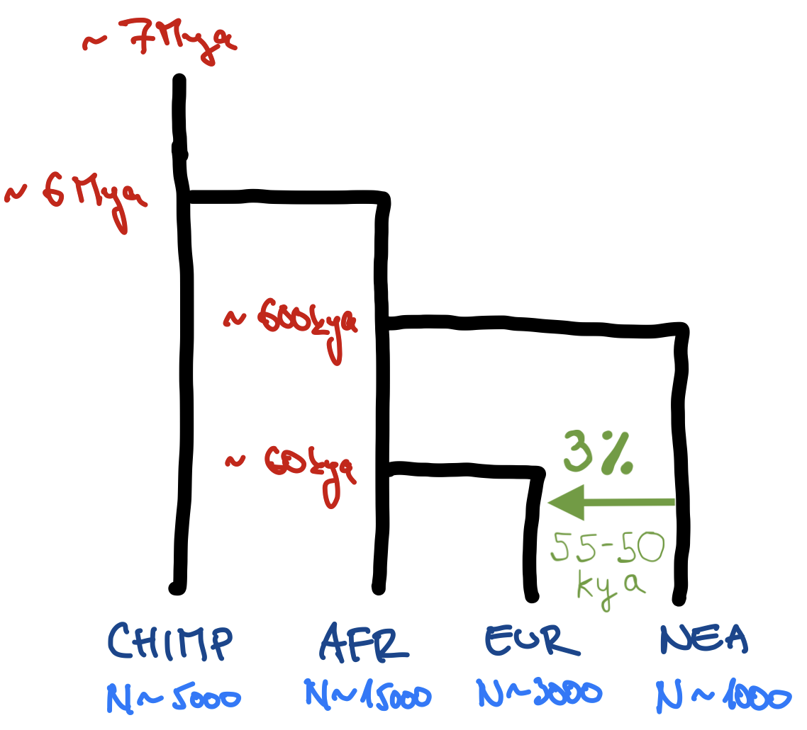

<!-- TODO: Looks at these links to define a custom "Show the solution" callout -->
<!-- https://www.youtube.com/watch?v=DDQO_3R-q74 -->
<!-- https://examples.quarto.pub/collapse-callout/ -->

# Reference materials

Unless you're already an expert on the *slendr* toolkit, you will probably need some reference materials to do the exercises. Here are the options:

1.  You can refer to the slides with the *slendr* crash course. You can find the material rendered as [normal slides](https://bodkan.quarto.pub/cesky-krumlov-2025-slides/) or [one-page handouts](https://bodkan.quarto.pub/cesky-krumlov-2025-handouts/) (the latter being probably a bit more practical for reference.
2.  Relevant tutorials on the [*slendr* website](https://www.slendr.net) which you can find under the "Articles" link in the header.
3.  [Manual pages](https://www.slendr.net/reference/index.html) of all available *slendr* functions. Note that you can get the help page of every *slendr* R `function` by typing `?function` in the R console. For instance, typing `?ts_tajima` gives you the help page of the *tskit*/*slendr* function implementing the tree-based computation of Tajima's D.

# Installation setup

The easiest way to set up everything on your computer is to do the following:

1.  Clone the repository with the activity materials (source code with slides and exercises materials, example scripts, and solutions). In a shell terminal on Linux or macOS, in your home directory (or anywhere else, really) you can run:

    ```         
    $ git clone https://github.com/bodkan/cesky-krumlov-2025 ~/slendr_activity
    ```

2.  Install all the R package dependencies by going into the activity repository directory you just cloned and installing the necessary R packages by following these steps:

-   First go into the project directory you just cloned:

    ```         
    $ cd ~/slendr_activity
    ```

-   Open the R terminal in that directory. You should get a note that the *renv* package is being automatically setup, like this:

    ```         
    $ R

    [... R startup information stuff ...]

    # Bootstrapping renv 1.0.11 --------------------------------------------------
    - Downloading renv ... OK
    - Installing renv  ... OK

    - Project '~/slendr_activity' loaded. [renv 1.0.11]
    - One or more packages recorded in the lockfile are not installed.
    - Use `renv::status()` for more details.
    ```

-   Install the R package dependencies (still in the R console!):

    ```         
    > renv::restore(prompt = FALSE)
    ```

-   Set up the Python environment used by the *slendr* R package for simulation and tree-sequence analysis (still in the R console!):

    ```         
    > slendr::setup_env(agree = TRUE)
    ```

    If everything worked, you should get an optimistic message saying:

    ```         
    ======================================================================
    Python environment for slendr has been successfuly created, and the R
    interface to msprime, tskit, and pyslim modules has been activated.

    In future sessions, activate this environment by calling init_env().
    =======================================================================
    ```

4.  Open RStudio and navigate to your project directory via `File -> Open Project...`.

**If the `setup_env()` installation procedure fails, try the following:**

1.  Delete the failed installation attempt:

```         
slendr::clear_env(force = TRUE, all = TRUE)
```

2.  Try installing it again, this time using `pip` as a Python installation method (the default is `conda` which unfortunately fails fairly often):

```         
slendr::setup_env(agree = TRUE, pip = TRUE)
```

In every previous installments of this workshop, this is all that was needed to resolve problems.

**Installing SLiM**

It's unclear whether we will manage to go through the entirety of the final exercise. However, to be able to do this, having SLiM at least version 4.2 (and it being available in your unix `$PATH!`) is required. If this isn't possible for your, don't worry. You'll be able to do most of that exercise even without SLiM, and I will demonstrate the whole exercise (including the SLiM bit) for you.

# How will this activity session work?

Your goal for each exercise will be to write a complete script. I suggest you name the script for each exercise as `exercise1.R`, `exercise2.R`, etc., to keep things tidy.

Unless you have a strong preference for another editor or IDE, I recommend you use RStudio (either on your machine or in the cloud, depending on where you did the setup steps above).

Each exercise is compose of individual *parts*, which are designed to build one upon the other in the order they are specified.

All the exercises will involve "real coding"! If you've never really programmed entire scripts before, this could feel a little intimidating. Don't worry. If you're ever lost, just take a peek at the solution which is (by default hidden) under each exercise section. Always try to work on a solution on your own, but never let this be a barrier to your progress. Feel free to copy-paste bits of my solutions into your own scripts.

If you find yourself [*totally lost*](https://scryfall.com/card/gtc/54/totally-lost), don't hesitate to read my solutions from the get go, copy-pasting them into your own script in the RStudio, executing them line by line, and trying to understand what's going on.


# Start of the exercises

For each exercise, you will get a brief explanation of the problem at hand and functions that could be useful to solve the exercise. **The concrete, specific task will be always written like this in bold.**


## Exercise 1

### Part 1: Building a demographic model in *slendr*

Use functions such as `population()`, `gene_flow()`, and `compile_model()` to **program the following toy model of human demographic history in _slendr_.**

{width="50%"}

**Hint:** Start script `exercise1.R` script in your RStudio session using this "template":


::: {.cell}

```{.r .cell-code  code-fold="false"}
library(slendr)
init_env()

<... population definitions ...>
<... gene-flow definition ...>

model <- compile_model(
  populations = list(...),
  gene_flow = <...>,
  generation_time = 30
)
```
:::


::: aside
**Note:** With *slendr* you can specify time in whatever format is more convenient or readable for your model. For instance here, because we're dealing with historical events which are commonly expressed in times given as"years ago", we can write them in a decreasing order – i.e. 7Mya → 6Mya → ..., as shown above – or, in terms of R code, 7e6 (or 7000000), 6e6 (6000000), etc..
:::

:::{.callout-note}
### Click to see the solution


::: {.cell}

```{.r .cell-code}
library(slendr)
init_env()
## The interface to all required Python modules has been activated.

# Chimpanzee outgroup
chimp <- population("CHIMP", time = 7e6, N = 5000)

# Two populations of anatomically modern humans: Africans and Europeans
afr <- population("AFR", parent = chimp, time = 6e6, N = 15000)
eur <- population("EUR", parent = afr, time = 70e3, N = 3000)

# Neanderthal population splitting at 600 ky ago from modern humans
# (becomes extinct by 40 ky ago)
nea <- population("NEA", parent = afr, time = 600e3, N = 1000, remove = 40e3)

# Neanderthal introgression event (3% admixture between 55-50 kya)
gf <- gene_flow(from = nea, to = eur, rate = 0.03, start = 55000, end = 50000)

# Compile the entire model into a single slendr R object
model <- compile_model(
  populations = list(chimp, nea, afr, eur),
  gene_flow = gf,
  generation_time = 30,
  path = here::here("data/introgression"),  # <--- don't worry about these two
  overwrite = TRUE, force = TRUE            #      lines of code (ask me if interested)
)
```
:::


:::

### Part 2: Inspecting the model visually

To visualize a *slendr* model, you can use the function `plot_model()`. **Plot your compiled `model` to make sure you programmed it correctly!**

::: aside
**Note:** Plotting of models can be sometimes a little wonky. When plotting your model, experiment with arguments `log = TRUE`, `proportions = TRUE`, `gene_flow = TRUE`. Check `?plot_model` for more information on these.
:::

:::{.callout-note}
### Click to see the solution


::: {.cell}

```{.r .cell-code}
plot_model(model)
```

::: {.cell-output-display}
{width=672}
:::

```{.r .cell-code}
plot_model(model, sizes = FALSE)
```

::: {.cell-output-display}
{width=672}
:::

```{.r .cell-code}
plot_model(model, sizes = FALSE, log = TRUE)
```

::: {.cell-output-display}
{width=672}
:::

```{.r .cell-code}
plot_model(model, sizes = FALSE, log = TRUE, proportions = TRUE)
```

::: {.cell-output-display}
{width=672}
:::
:::


:::

### Part 3: Simulating genomic data

Once you have a compiled *slendr* model stored in an R variable (from now on, `model` will always mean a variable containing a compiled *slendr* model object, for simplicity), we can simulate data from it. By default, *slendr* models always produce a [tree sequence](https://tskit.dev/tutorials/what_is.html).

There are two simulation engines built into *slendr* implemented by functions `msprime()` and `slim()`. For traditional, non-spatial, neutral demographic models, the engine provided by the `msprime()` function is much more efficient, so we'll be using that.

Here's how you can use it to simulate a tree sequence:


::: {.cell}

```{.r .cell-code  code-fold="false"}
ts <- msprime(<model object>, sequence_length = <length of sequence to simulate [as bp]>, recombination_rate = <uniform recombination rate [per bp per generation]>)
```
:::


The function has also arguments `debug` and `run`.

**Simulate a tree sequence from your compiled `model`, storing it to a variable `ts` as shown right above. Then experiment with setting `debug = TRUE` (this prints out *msprime*'s own debugging summary) and then `run = FALSE` (this prints out a raw command-line which can run a *slendr* simulation in the shell).**

:::{.callout-note}
### Click to see the solution


::: {.cell}

```{.r .cell-code}
# This simulates a tskit tree sequence from a slendr model. Note that you didn't have
# to write any msprime or tskit Python code!
ts <- msprime(model, sequence_length = 1e6, recombination_rate = 1e-8)

# Setting `debug = TRUE` instructs slendr's built-in msprime script to print
# out msprime's own debugger information. This can be very useful for debugging,
# in addition to the visualization of the model as shown above.
ts <- msprime(model, sequence_length = 1e6, recombination_rate = 1e-8, debug = TRUE)
## DemographyDebugger
## ╠═════════════════════════════════════╗
## ║ Epoch[0]: [0, 1.67e+03) generations ║
## ╠═════════════════════════════════════╝
## ╟    Populations (total=4 active=4)
## ║    ┌─────────────────────────────────────────────────────────────────────┐
## ║    │       │     start│       end│growth_rate  │ CHIMP │ AFR │ NEA │ EUR │
## ║    ├─────────────────────────────────────────────────────────────────────┤
## ║    │  CHIMP│    5000.0│    5000.0│ 0           │   0   │  0  │  0  │  0  │
## ║    │    AFR│   15000.0│   15000.0│ 0           │   0   │  0  │  0  │  0  │
## ║    │    NEA│    1000.0│    1000.0│ 0           │   0   │  0  │  0  │  0  │
## ║    │    EUR│    3000.0│    3000.0│ 0           │   0   │  0  │  0  │  0  │
## ║    └─────────────────────────────────────────────────────────────────────┘
## ╟    Events @ generation 1.67e+03
## ║    ┌─────────────────────────────────────────────────────────────────────────────────────────┐
## ║    │  time│type            │parameters              │effect                                  │
## ║    ├─────────────────────────────────────────────────────────────────────────────────────────┤
## ║    │  1666│Migration rate  │source=EUR, dest=NEA,   │Backwards-time migration rate from EUR  │
## ║    │      │change          │rate=0.000179640718562  │to NEA → 0.00017964071856287425         │
## ║    │      │                │87425                   │                                        │
## ║    └─────────────────────────────────────────────────────────────────────────────────────────┘
## ╠════════════════════════════════════════════╗
## ║ Epoch[1]: [1.67e+03, 1.83e+03) generations ║
## ╠════════════════════════════════════════════╝
## ╟    Populations (total=4 active=4)
## ║    ┌───────────────────────────────────────────────────────────────────────────┐
## ║    │       │     start│       end│growth_rate  │ CHIMP │ AFR │    NEA    │ EUR │
## ║    ├───────────────────────────────────────────────────────────────────────────┤
## ║    │  CHIMP│    5000.0│    5000.0│ 0           │   0   │  0  │     0     │  0  │
## ║    │    AFR│   15000.0│   15000.0│ 0           │   0   │  0  │     0     │  0  │
## ║    │    NEA│    1000.0│    1000.0│ 0           │   0   │  0  │     0     │  0  │
## ║    │    EUR│    3000.0│    3000.0│ 0           │   0   │  0  │ 0.0001796 │  0  │
## ║    └───────────────────────────────────────────────────────────────────────────┘
## ╟    Events @ generation 1.83e+03
## ║    ┌────────────────────────────────────────────────────────────────────────────────────────┐
## ║    │  time│type            │parameters             │effect                                  │
## ║    ├────────────────────────────────────────────────────────────────────────────────────────┤
## ║    │  1833│Migration rate  │source=EUR, dest=NEA,  │Backwards-time migration rate from EUR  │
## ║    │      │change          │rate=0                 │to NEA → 0                              │
## ║    │┈┈┈┈┈┈┈┈┈┈┈┈┈┈┈┈┈┈┈┈┈┈┈┈┈┈┈┈┈┈┈┈┈┈┈┈┈┈┈┈┈┈┈┈┈┈┈┈┈┈┈┈┈┈┈┈┈┈┈┈┈┈┈┈┈┈┈┈┈┈┈┈┈┈┈┈┈┈┈┈┈┈┈┈┈┈┈┈│
## ║    │  1833│Census          │                       │Insert census nodes to record the       │
## ║    │      │                │                       │location of all lineages                │
## ║    └────────────────────────────────────────────────────────────────────────────────────────┘
## ╠════════════════════════════════════════════╗
## ║ Epoch[2]: [1.83e+03, 2.33e+03) generations ║
## ╠════════════════════════════════════════════╝
## ╟    Populations (total=4 active=4)
## ║    ┌─────────────────────────────────────────────────────────────────────┐
## ║    │       │     start│       end│growth_rate  │ CHIMP │ AFR │ NEA │ EUR │
## ║    ├─────────────────────────────────────────────────────────────────────┤
## ║    │  CHIMP│    5000.0│    5000.0│ 0           │   0   │  0  │  0  │  0  │
## ║    │    AFR│   15000.0│   15000.0│ 0           │   0   │  0  │  0  │  0  │
## ║    │    NEA│    1000.0│    1000.0│ 0           │   0   │  0  │  0  │  0  │
## ║    │    EUR│    3000.0│    3000.0│ 0           │   0   │  0  │  0  │  0  │
## ║    └─────────────────────────────────────────────────────────────────────┘
## ╟    Events @ generation 2.33e+03
## ║    ┌───────────────────────────────────────────────────────────────────────────┐
## ║    │  time│type        │parameters      │effect                                │
## ║    ├───────────────────────────────────────────────────────────────────────────┤
## ║    │  2333│Population  │derived=[EUR],  │Moves all lineages from the 'EUR'     │
## ║    │      │Split       │ancestral=AFR   │derived population to the ancestral   │
## ║    │      │            │                │'AFR' population. Also set 'EUR' to   │
## ║    │      │            │                │inactive, and all migration rates to  │
## ║    │      │            │                │and from the derived population to    │
## ║    │      │            │                │zero.                                 │
## ║    └───────────────────────────────────────────────────────────────────────────┘
## ╠═════════════════════════════════════════╗
## ║ Epoch[3]: [2.33e+03, 2e+04) generations ║
## ╠═════════════════════════════════════════╝
## ╟    Populations (total=4 active=3)
## ║    ┌───────────────────────────────────────────────────────────────┐
## ║    │       │     start│       end│growth_rate  │ CHIMP │ AFR │ NEA │
## ║    ├───────────────────────────────────────────────────────────────┤
## ║    │  CHIMP│    5000.0│    5000.0│ 0           │   0   │  0  │  0  │
## ║    │    AFR│   15000.0│   15000.0│ 0           │   0   │  0  │  0  │
## ║    │    NEA│    1000.0│    1000.0│ 0           │   0   │  0  │  0  │
## ║    └───────────────────────────────────────────────────────────────┘
## ╟    Events @ generation 2e+04
## ║    ┌────────────────────────────────────────────────────────────────────────────┐
## ║    │   time│type        │parameters      │effect                                │
## ║    ├────────────────────────────────────────────────────────────────────────────┤
## ║    │  2e+04│Population  │derived=[NEA],  │Moves all lineages from the 'NEA'     │
## ║    │       │Split       │ancestral=AFR   │derived population to the ancestral   │
## ║    │       │            │                │'AFR' population. Also set 'NEA' to   │
## ║    │       │            │                │inactive, and all migration rates to  │
## ║    │       │            │                │and from the derived population to    │
## ║    │       │            │                │zero.                                 │
## ║    └────────────────────────────────────────────────────────────────────────────┘
## ╠══════════════════════════════════════╗
## ║ Epoch[4]: [2e+04, 2e+05) generations ║
## ╠══════════════════════════════════════╝
## ╟    Populations (total=4 active=2)
## ║    ┌─────────────────────────────────────────────────────────┐
## ║    │       │     start│       end│growth_rate  │ CHIMP │ AFR │
## ║    ├─────────────────────────────────────────────────────────┤
## ║    │  CHIMP│    5000.0│    5000.0│ 0           │   0   │  0  │
## ║    │    AFR│   15000.0│   15000.0│ 0           │   0   │  0  │
## ║    └─────────────────────────────────────────────────────────┘
## ╟    Events @ generation 2e+05
## ║    ┌──────────────────────────────────────────────────────────────────────────────┐
## ║    │   time│type        │parameters       │effect                                 │
## ║    ├──────────────────────────────────────────────────────────────────────────────┤
## ║    │  2e+05│Population  │derived=[AFR],   │Moves all lineages from the 'AFR'      │
## ║    │       │Split       │ancestral=CHIMP  │derived population to the ancestral    │
## ║    │       │            │                 │'CHIMP' population. Also set 'AFR' to  │
## ║    │       │            │                 │inactive, and all migration rates to   │
## ║    │       │            │                 │and from the derived population to     │
## ║    │       │            │                 │zero.                                  │
## ║    └──────────────────────────────────────────────────────────────────────────────┘
## ╠════════════════════════════════════╗
## ║ Epoch[5]: [2e+05, inf) generations ║
## ╠════════════════════════════════════╝
## ╟    Populations (total=4 active=1)
## ║    ┌─────────────────────────────────────────┐
## ║    │       │    start│      end│growth_rate  │
## ║    ├─────────────────────────────────────────┤
## ║    │  CHIMP│   5000.0│   5000.0│ 0           │
## ║    └─────────────────────────────────────────┘

# For debugging of technical issues (with msprime, with slendr, or both), it is
# very useful to have the `msprime` function dump the "raw" command-line to
# run the simulation on the terminal using plain Python interpreter
msprime(model, sequence_length = 1e6, recombination_rate = 1e-8, run = FALSE)
## /Users/mp/Library/r-miniconda-arm64/envs/Python-3.12_msprime-1.3.3_tskit-0.5.8_pyslim-1.0.4_tspop-0.0.2/bin/python /Users/mp/Projects/cesky-krumlov-2025/data/introgression/script.py --seed 2004316007 --model /Users/mp/Projects/cesky-krumlov-2025/data/introgression --sequence-length 1000000 --recombination-rate 1e-08    --path <path to a .trees file>
```
:::


:::

### Part 4: Inspecting the tree-sequence object

As we'll see later, *slendr* tries to provide an R-friendly interface to accessing a subset of *tskit*'s functionality for working with tree sequence and for computing various popgen statistics.

For now, **type out the `ts` object in the terminal – what do you see?** You should get a summary of a tree-sequence object that you're familiar with from your *msprime* and *tskit* activity.

:::{.callout-note}
### Click to see the solution


::: {.cell}

```{.r .cell-code}
# Typing out the object with the result shows that it's a good old tskit
# tree-sequence object
ts
```

::: {.cell-output .cell-output-stdout}

```
╔═══════════════════════════╗
║TreeSequence               ║
╠═══════════════╤═══════════╣
║Trees          │       9779║
╟───────────────┼───────────╢
║Sequence Length│    1000000║
╟───────────────┼───────────╢
║Time Units     │generations║
╟───────────────┼───────────╢
║Sample Nodes   │      48000║
╟───────────────┼───────────╢
║Total Size     │    8.9 MiB║
╚═══════════════╧═══════════╝
╔═══════════╤══════╤═════════╤════════════╗
║Table      │Rows  │Size     │Has Metadata║
╠═══════════╪══════╪═════════╪════════════╣
║Edges      │134950│  4.1 MiB│          No║
╟───────────┼──────┼─────────┼────────────╢
║Individuals│ 24000│656.3 KiB│          No║
╟───────────┼──────┼─────────┼────────────╢
║Migrations │     0│  8 Bytes│          No║
╟───────────┼──────┼─────────┼────────────╢
║Mutations  │     0│ 16 Bytes│          No║
╟───────────┼──────┼─────────┼────────────╢
║Nodes      │105053│  2.8 MiB│          No║
╟───────────┼──────┼─────────┼────────────╢
║Populations│     4│341 Bytes│         Yes║
╟───────────┼──────┼─────────┼────────────╢
║Provenances│     1│  2.7 KiB│          No║
╟───────────┼──────┼─────────┼────────────╢
║Sites      │     0│ 16 Bytes│          No║
╚═══════════╧══════╧═════════╧════════════╝
```


:::
:::


:::

**Use the `ts_table` function to inspect the low-level table-based representation of a tree sequence.** For instance, you can get the table of nodes with `ts_table(ts, "nodes")`, edges with `ts_table(ts, "edges")`, and do the same thing for "individuals", "mutations", and "sites". Does your tree sequence contain any mutations? If not, why?

:::{.callout-note}
### Click to see the solution


::: {.cell}

```{.r .cell-code}
# slendr provides a helper function which allows access to all the low-level
# components of every tree-sequence object
ts_table(ts, "nodes")
```

::: {.cell-output .cell-output-stdout}

```
# A tibble: 105,053 × 5
   node_id    ind_id pop_id  time time_tskit
     <int> <int[1d]>  <int> <dbl>      <dbl>
 1       0         0      0     0          0
 2       1         0      0     0          0
 3       2         1      0     0          0
 4       3         1      0     0          0
 5       4         2      0     0          0
 6       5         2      0     0          0
 7       6         3      0     0          0
 8       7         3      0     0          0
 9       8         4      0     0          0
10       9         4      0     0          0
# ℹ 105,043 more rows
```


:::

```{.r .cell-code}
ts_table(ts, "edges")
```

::: {.cell-output .cell-output-stdout}

```
# A tibble: 134,950 × 5
      id child parent  left   right
   <dbl> <int>  <int> <dbl>   <dbl>
 1     0 34631  48000     0 1000000
 2     1 38245  48000     0 1000000
 3     2 21116  48001     0 1000000
 4     3 30113  48001     0 1000000
 5     4 32113  48002     0 1000000
 6     5 37399  48002     0 1000000
 7     6 18398  48003     0 1000000
 8     7 23682  48003     0 1000000
 9     8  2519  48004     0 1000000
10     9  2766  48004     0 1000000
# ℹ 134,940 more rows
```


:::

```{.r .cell-code}
ts_table(ts, "individuals")
```

::: {.cell-output .cell-output-stdout}

```
# A tibble: 24,000 × 5
   ind_id  time    pop_id time_tskit sampled
    <dbl> <dbl> <int[1d]>  <dbl[1d]> <lgl>  
 1      0     0         0          0 TRUE   
 2      1     0         0          0 TRUE   
 3      2     0         0          0 TRUE   
 4      3     0         0          0 TRUE   
 5      4     0         0          0 TRUE   
 6      5     0         0          0 TRUE   
 7      6     0         0          0 TRUE   
 8      7     0         0          0 TRUE   
 9      8     0         0          0 TRUE   
10      9     0         0          0 TRUE   
# ℹ 23,990 more rows
```


:::

```{.r .cell-code}
# We didn't simulate any mutations, so we only have genealogies for now.
ts_table(ts, "mutations")
```

::: {.cell-output .cell-output-stdout}

```
# A tibble: 0 × 5
# ℹ 5 variables: id <dbl>, site <int>, node <int>, time <dbl>, time_tskit <dbl>
```


:::

```{.r .cell-code}
ts_table(ts, "sites")
```

::: {.cell-output .cell-output-stdout}

```
# A tibble: 0 × 2
# ℹ 2 variables: id <dbl>, position <dbl>
```


:::
:::


:::

There are also two *slendr*-specific functions called `ts_samples()` and `ts_nodes()`. **You can run them simply as `ts_samples(ts)` and `ts_nodes(ts)`. What do the tables they produce represent?**

:::{.callout-note}
### Click to see the solution


::: {.cell}

```{.r .cell-code}
# slendr provides a convenient function `ts_samples()` which allows us to
# inspect the contents of a simulated tree sequence in a more human-readable,
# simplified way. We can see that our tree sequence contains a massive number
# of individuals. Too many, in fact (we recorded every single individual alive
# at the end of our simulation -- something we're unlikely to be ever lucky
# enough to have, regardless of which species we study)
ts_samples(ts) %>% nrow()
```

::: {.cell-output .cell-output-stdout}

```
[1] 24000
```


:::

```{.r .cell-code}
# This function returns a table similar to the one produced by `ts_table(ts, "nodes")`
# above, except that it contains additional slendr metadata (names of individuals
# belonging to each node, spatial coordinates of nodes for spatial models, etc.).
# It's a bit more useful for analyzing tree-sequence data than the "low-level" functions.
ts_nodes(ts)
```

::: {.cell-output .cell-output-stdout}

```
# A tibble: 105,053 × 8
   name  pop   ind_id node_id  time time_tskit sampled pop_id
   <chr> <fct>  <dbl>   <int> <dbl>      <dbl> <lgl>    <int>
 1 AFR_1 AFR     5000   10000     0          0 TRUE         1
 2 AFR_1 AFR     5000   10001     0          0 TRUE         1
 3 AFR_2 AFR     5001   10002     0          0 TRUE         1
 4 AFR_2 AFR     5001   10003     0          0 TRUE         1
 5 AFR_3 AFR     5002   10004     0          0 TRUE         1
 6 AFR_3 AFR     5002   10005     0          0 TRUE         1
 7 AFR_4 AFR     5003   10006     0          0 TRUE         1
 8 AFR_4 AFR     5003   10007     0          0 TRUE         1
 9 AFR_5 AFR     5004   10008     0          0 TRUE         1
10 AFR_5 AFR     5004   10009     0          0 TRUE         1
# ℹ 105,043 more rows
```


:::
:::


:::


### Part 5: Scheduling sampling events

In the table produced by the `ts_samples()` function, you can see that the tree sequence
we simulated record _everyone_. It's very unlikely, unless we're extremely lucky, that
we'll ever have a sequence of every single individual in a population that we study. To
get a little closer to the scale of the genomic data that we'll be working with, we can
restrict our simulation to only record a subset of individuals.

We can precisely define which individuals (from which populations, and at which times)
should be recorded in a tree sequence using the _slendr_ function `schedule_sampling()`.
For instance, if we have a `model` with some _slendr_ populations in variables `popX`
`popY`, we can schedule the recording of 5 individuals from each at times 10000 (years
ago) and 0 (present-day) by the following code:


::: {.cell}

```{.r .cell-code}
pop_schedule <- schedule_sampling(model, times = c(10000, 0), list(popX, 5), list(popY), 5)
```
:::


This function simply returns a data frame. As such, we can create multiple of such schedules
(of arbitrary complexity and granularity), and then bind them together with a single line
of code, like this:


::: {.cell}

```{.r .cell-code}
# Note that the `times =` argument can be a vector of times...
ancient_times <- c(40000, 30000, 20000, 10000)
eur_samples <- schedule_sampling(model, times = ancient_times, list(eur, 1))
# ... but also just a single number
afr_samples <- schedule_sampling(model, times = 0, list(afr, 1), list(eur, 42))
nea_samples <- schedule_sampling(model, time = 60000, list(nea, 1))

# And that multiple such sampling schedules can be bound together like this:
samples <- rbind(eur_samples, afr_samples, nea_samples)
```
:::


**Using the function `schedule_sampling` (and with the help of `rbind`), program
the sampling of the following sample sets at given times, saving it to variable called `schedule`:**

 time | population(s) | # individuals
------|:------|----
70000 | nea   |   1
40000 | nea   |   1
    0 | chimp, afr, eur |   5

**Additionally, schedule the sampling of one `eur` individual at these times:**


::: {.cell}

```{.r .cell-code}
times <- seq(40000, 2000, by = -2000)
```
:::


In total, you should schedule the recording of 38 individuals.

:::{.callout-note}
### Click to see the solution


::: {.cell}

```{.r .cell-code}
# Here we scheduled the sampling of two Neanderthals at 70kya and 40kya
nea_samples <- schedule_sampling(model, times = c(70000, 40000), list(nea, 1))
nea_samples # (this function produces a plain old data frame!)
```

::: {.cell-output .cell-output-stdout}

```
# A tibble: 2 × 7
   time pop       n y_orig x_orig y     x    
  <int> <chr> <int> <lgl>  <lgl>  <lgl> <lgl>
1 40000 NEA       1 NA     NA     NA    NA   
2 70000 NEA       1 NA     NA     NA    NA   
```


:::

```{.r .cell-code}
# Here we schedule one Chimpanzee sample, 5 African samples, and 10 European samples
present_samples <- schedule_sampling(model, times = 0, list(chimp, 1), list(afr, 5), list(eur, 10))

# We also schedule the recording of one European sample between 50kya and 2kya,
# every 2000 years
times <- seq(40000, 2000, by = -2000)
emh_samples <- schedule_sampling(model, times, list(eur, 1))

# Because those functions produce nothing but a data frame, we can bind
# individual sampling schedules together
schedule <- rbind(nea_samples, present_samples, emh_samples)
schedule
```

::: {.cell-output .cell-output-stdout}

```
# A tibble: 25 × 7
    time pop       n y_orig x_orig y     x    
   <int> <chr> <int> <lgl>  <lgl>  <lgl> <lgl>
 1 40000 NEA       1 NA     NA     NA    NA   
 2 70000 NEA       1 NA     NA     NA    NA   
 3     0 CHIMP     1 NA     NA     NA    NA   
 4     0 AFR       5 NA     NA     NA    NA   
 5     0 EUR      10 NA     NA     NA    NA   
 6  2000 EUR       1 NA     NA     NA    NA   
 7  4000 EUR       1 NA     NA     NA    NA   
 8  6000 EUR       1 NA     NA     NA    NA   
 9  8000 EUR       1 NA     NA     NA    NA   
10 10000 EUR       1 NA     NA     NA    NA   
# ℹ 15 more rows
```


:::
:::


:::

**Then, verify the correctness of your overall sampling `schedule` by visualizing
it together with your `model` like this:**

::: aside
**Note:** As you've seen above, the visualization is often a bit wonky and convoluted with overlapping elements and it can be even worse with samples added, but try to experiment with arguments to `plot_model` described above to make the plot a bit more helpful for sanity checking.
:::


::: {.cell}

```{.r .cell-code}
plot_model(model, samples = schedule)
```
:::


:::{.callout-note}
### Click to see the solution


::: {.cell}

```{.r .cell-code}
plot_model(model, sizes = FALSE, samples = schedule)
```

::: {.cell-output-display}
{width=672}
:::
:::

::: {.cell}

```{.r .cell-code}
plot_model(model, sizes = FALSE, log = TRUE, samples = schedule)
```

::: {.cell-output-display}
{width=672}
:::
:::


:::


### Part 6: Simulating a defined set of individuals 

**Use your combined sampling schedule stored in the `schedule` variable to run a new tree-sequence simulation from your model (again using the `msprime()` function), this time restricted to just those individuals scheduled for recording.** You can do this by providing the combined sampling schedule as the `samples =` argument of the function `msprime` you used above.

:::{.callout-note}
### Click to see the solution


::: {.cell}

:::

::: {.cell}

```{.r .cell-code}
# The command below will likely take a few minutes to run, so feel free to go
# down from 100 Mb sequence_length to even 10Mb (it doesn't matter much)
# tstart <- Sys.time()
ts <-
  msprime(model, sequence_length = 100e6, recombination_rate = 1e-8, samples = schedule, random_seed = 1269258439) %>%
  ts_mutate(mutation_rate = 1e-8, random_seed = 1269258439)
# tend <- Sys.time()
# tend - tstart # Time difference of 2.141642 mins

# If you're bothered by ho long this takes, feel free to call these two lines
# to 100% reproduce my results without any expensive computation:
model <- read_model(here::here("data/introgression"))
ts <- ts_read(here::here(file = "data/introgression.trees"), model = model)

# We can save a tree sequence object using a slendr function `ts_write` (this
# can be useful if we want to save the results of a simulation for later use).
dir.create("data", showWarnings = FALSE)
ts_write(ts, "data/introgression.trees")
```
:::


:::


**Inspect the tree-sequence object saved in the `ts` variable again, taking note of the (now much smaller!) number of individuals. You can also do a similar thing via the table produced by the `ts_samples()` function.**

:::{.callout-note}
### Click to see the solution


::: {.cell}

```{.r .cell-code}
# Inspect the (tskit/Python-based) summary of the new tree sequence
ts
```

::: {.cell-output .cell-output-stdout}

```
╔═══════════════════════════╗
║TreeSequence               ║
╠═══════════════╤═══════════╣
║Trees          │     295199║
╟───────────────┼───────────╢
║Sequence Length│  100000000║
╟───────────────┼───────────╢
║Time Units     │generations║
╟───────────────┼───────────╢
║Sample Nodes   │         76║
╟───────────────┼───────────╢
║Total Size     │   85.1 MiB║
╚═══════════════╧═══════════╝
╔═══════════╤═══════╤═════════╤════════════╗
║Table      │Rows   │Size     │Has Metadata║
╠═══════════╪═══════╪═════════╪════════════╣
║Edges      │1051064│ 32.1 MiB│          No║
╟───────────┼───────┼─────────┼────────────╢
║Individuals│     38│  1.1 KiB│          No║
╟───────────┼───────┼─────────┼────────────╢
║Migrations │      0│  8 Bytes│          No║
╟───────────┼───────┼─────────┼────────────╢
║Mutations  │ 663287│ 23.4 MiB│          No║
╟───────────┼───────┼─────────┼────────────╢
║Nodes      │ 218703│  5.8 MiB│          No║
╟───────────┼───────┼─────────┼────────────╢
║Populations│      4│341 Bytes│         Yes║
╟───────────┼───────┼─────────┼────────────╢
║Provenances│      2│  5.7 KiB│          No║
╟───────────┼───────┼─────────┼────────────╢
║Sites      │ 660993│ 15.8 MiB│          No║
╚═══════════╧═══════╧═════════╧════════════╝
```


:::

```{.r .cell-code}
# Get the table of all recorded samples in the tree sequence
ts_samples(ts)
```

::: {.cell-output .cell-output-stdout}

```
# A tibble: 38 × 3
   name   time pop  
   <chr> <dbl> <chr>
 1 NEA_1 70000 NEA  
 2 EUR_1 40000 EUR  
 3 NEA_2 40000 NEA  
 4 EUR_2 38000 EUR  
 5 EUR_3 36000 EUR  
 6 EUR_4 34000 EUR  
 7 EUR_5 32000 EUR  
 8 EUR_6 30000 EUR  
 9 EUR_7 28000 EUR  
10 EUR_8 26000 EUR  
# ℹ 28 more rows
```


:::

```{.r .cell-code}
# Compute the count of individuals in different time points
suppressPackageStartupMessages(library(dplyr))

ts_samples(ts) %>% group_by(pop, time == 0) %>% tally %>% select(pop, n)
```

::: {.cell-output .cell-output-stdout}

```
# A tibble: 5 × 2
# Groups:   pop [4]
  pop       n
  <chr> <int>
1 AFR       5
2 CHIMP     1
3 EUR      20
4 EUR      10
5 NEA       2
```


:::
:::


:::


# Exercise 2

**Reminder**: you can use the [one-page version of the slides](https://bodkan.quarto.pub/cesky-krumlov-2025-handouts) for reference (they contain everything you might need to do all the exercises). The solutions to the exercises are based on variations of examples from the [official *slendr* documentation](https://www.slendr.net), so feel free to browse through the relevant tutorials (available under "Articles" on the website), in case you are interested in more details.

## Sampling aDNA samples through time

<br>

Imagine we have `pop1`, `pop2`, ... compiled in a `model`.

<br>

To record *ancient* individuals in the tree sequence, we can use `schedule_sampling` like this:


::: {.cell}

```{.r .cell-code}
schedule_sampling(
  model,                # compiled slendr model object
  times = c(100, 500),  # at these times (can be also a single number) ...
  list(pop1, 42),       # ... sample 42 individuals from pop1
  list(pop2, 10),       # ... sample 10 individuals from pop2
  list(pop3, 1)         # ... sample 1 individual from pop 3
) 
```
:::


## Sampling schedule format

The output of `schedule_sampling()` is a plain data frame:


::: {.cell}

```{.r .cell-code}
schedule_sampling(model, times = c(40000, 30000, 20000, 10000), list(eur, 1))
```
:::


. . .

We can bind multiple sampling schedules together, giving us finer control about sampling:


::: {.cell}

```{.r .cell-code}
eur_samples <- schedule_sampling(model, times = c(40000, 30000, 20000, 10000, 0), list(eur, 1))
afr_samples <- schedule_sampling(model, times = 0, list(afr, 1))

samples <- rbind(eur_samples, afr_samples)
```
:::


## How to use a sampling schedule?

To sample individuals based on a given schedule, we use the `samples =` argument of the `msprime()` function:


::: {.cell}

```{.r .cell-code}
ts <-
  msprime(model, samples = samples, sequence_length = 1e6, recombination_rate = 1e-8) %>% 
  ts_mutate(mutation_rate = 1e-8)
```
:::


. . .

We can verify that only specific individuals are recorded:


::: {.cell}

```{.r .cell-code}
ts_samples(ts)
```
:::


# Exercise #4

<br><br><br><br>

::: aside
Use [these](https://bodkan.quarto.pub/ku-popgen2023-onepage/) one-page handouts for reference.
:::

**Reminder**: you can use the [one-page version of the slides](https://bodkan.quarto.pub/cesky-krumlov-2025-handouts) for reference (they contain everything you might need to do all the exercises). The solutions to the exercises are based on variations of examples from the [official *slendr* documentation](https://www.slendr.net), so feel free to browse through the relevant tutorials (available under "Articles" on the website), in case you are interested in more details.

## Exercise #4a: ancient samples

Let's return to your introgression model:


::: {.cell layout-align="center"}

:::


## Exercise #4a: ancient samples

Simulate data from your model using this sampling:

-   one present-day CHIMP and AFR individual
-   20 present-day EUR individuals
-   1 NEA at 70 ky, 1 NEA at 40 ky
-   1 EUR every 1000 years between 50-5 kya

Reminder: you can do this by:


::: {.cell}

```{.r .cell-code}
samples <- # rbind(...) together individual schedule_sampling() data frames

ts <-
  msprime(model, samples = samples, sequence_length = 100e6, recombination_rate = 1e-8) %>%
  ts_mutate(mutation_rate = 1e-8)
```
:::


## Exercise #4b: $f_4$-ratio statistic

Use $f_4$-ratio statistic to replicate the [following figure](https://www.pnas.org/doi/10.1073/pnas.1814338116#fig01):

{width="60%" fig-align="center"}

## Exercise #3: more statistics! (a)

Use `msprime()` to simulate a 50Mb tree sequence `ts` from your introgression model in `model1.R` (if that takes more than two minutes, try just 10Mb).


::: {.cell layout-align="center"}

:::


(Remember to add mutations with `ts_mutate()`.)

## Exercise #3: more statistics! (b)

**In `model1.R` compute (some of) these on your `ts` object:**

-   nucleotide [`ts_diversity()`](https://www.slendr.net/reference/ts_diversity.html#ref-examples) in each population <br>

-   [`ts_divergence()`](https://www.slendr.net/reference/ts_divergence.html#ref-examples) between populations<br>

-   outgroup [`ts_f3(A; B, C)`](https://www.slendr.net/reference/ts_f4ratio.html#ref-examples) using CHIMP as the outgroup (A!) for different pairs of "B" and "C" populations<br>

    -   using Ben's explanation on Wednesday, try to compute this $f_3$ using combination of $f_2$ statistics (`ts_f2(A, B)`)

**You can find help by typing `?ts_diversity` etc. into R!**

## Exercise #3: more statistics! (c)

-   **Compute** $f_4$ test of Neanderthal introgression in EUR:

    -   Hint: check the values of these two statistics (`ts_f4()`):

        -   $f_4$(\<afr\>, \<eur\>; \<neand\>, \<chimp\>)
        -   $f_4$(\<afr1\>, \<afr2\>; \<neand\>, \<chimp\>)\]

    -   Is one "much more negative" than the other as expected assuming introgression?

-   You've learned about symmetries in $f_4$ depending on the arrangement of the "quartet". **How many unique** $f_4$ values involving a single quartet can you find and why? (When computing `ts_f4()` here, set `mode = "branch"`).

# Exercise 3

**Reminder**: you can use the [handout version of the slides]() for reference.

<br><br><br><br>

::: aside
Use [these](https://bodkan.quarto.pub/ku-popgen2023-onepage/) one-page handouts for reference.
:::

## Part *a*: One-population AFS simulator

In a new script `model2.R` write a function called `simulate_afs()`, which will take `Ne` as its only parameter.

It should create a one-population *forward-time* model (`simulation_length` 100000, `generation_time` 1), simulate 10Mb tree sequence (recombination and mutation rates of 1e-8), compute AFS for 10 samples and return it.

. . .

<hr>

**Use this function to compute AFS vectors for various `Ne` values. Plot those AFS and observe how (and why?) do they differ based on `Ne` you simulated.**

## Part *a*: Hint

You can start building `model2.R` from this "template":


::: {.cell}

```{.r .cell-code}
library(slendr); init_env()

simulate_afs <- function(Ne) {
  ... your one-population model code: population(), compile_model(), msprime() ...
  
  result <- ... compute AFS using ts_afs() on 10 samples, save it to `result` ...

  return(result)
}

afs_1 <- simulate_afs(Ne = 1000)
plot(afs_1, type ="o")
```
:::


::: fragment
<small> **Note:** We drop the first element (`afs[-1]`) technical reasons related to *tskit*. You don't have to worry about that here, but you can read [this](https://tskit.dev/tutorials/analysing_tree_sequences.html#sec-tutorial-afs-zeroth-entry) for more detail. </small>
:::

::: fragment
When used in R, your function should work like this:


::: {.cell}

:::

::: {.cell}

```{.r .cell-code}
simulate_afs(Ne = 1000)
```
:::


:::

## Part *b*: Estimating Ne using AFS


::: {.cell}

:::


Imagine you sequenced 10 samples from a population and computed this AFS vector in R (# singletons, doubletons, etc.):

<!-- dput(as.vector(observed_afs)) -->


::: {.cell}

```{.r .cell-code}
afs_observed <- c(2520, 1449, 855, 622, 530, 446, 365, 334, 349, 244,
                  264, 218,  133, 173, 159, 142, 167, 129, 125, 143)
```
:::


. . .

You know that the population had a constant $N_e$ somewhere between 1000 and 30000 for the past 100,000 generations, and had mutation and recombination rates of 1e-8 (i.e., parameters already implemented by the `simulate_afs()` function).

. . .

<hr>

**Guess the true** $N_e$ given the observed AFS by running single-population simulations for a range of $N_e$ values and comparing each run to `afs_observed`.

## Part *b*: Hints

Using your custom `simulate_afs()` function, find the value of `Ne` that will give the closest AFS to the observed AFS:

-   *option #1* \[*easy*\]: Plot AFS vectors for various $N_e$ values, then eyeball which looks closest to the observed AFS

-   *option #2* \[*hard*\]: Simulate AFS vectors in steps of possible `Ne` (maybe `lapply()`?), find the [closest](https://en.wikipedia.org/wiki/Mean_squared_error) AFS

# Exercise #2: solution

<br><br><br><br>

::: aside
See [`ex2_simple.R`](https://github.com/bodkan/ku-popgen2023/blob/main/solutions/ex2_simple.R) for a simple "eyeballing" solution.<br>

See [`ex2_grid.R`](https://github.com/bodkan/ku-popgen2023/blob/main/solutions/ex2_grid.R) for a more elaborate grid-search solution.
:::

# Exercise 4

**Reminder**: you can use the [handout version of the slides]() for reference.

# Exercise 5

**Reminder**: you can use the [handout version of the slides]() for reference.

